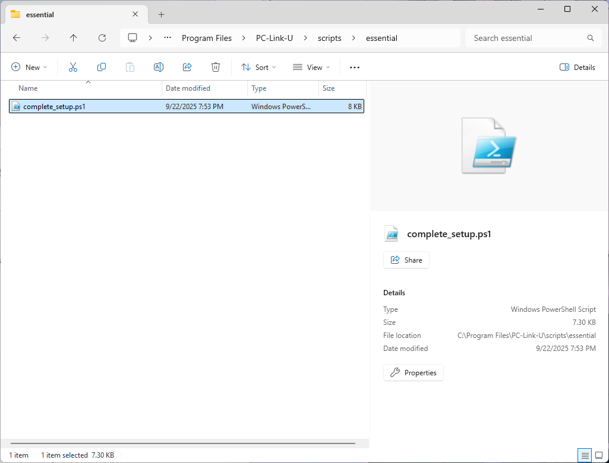
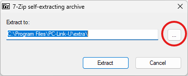
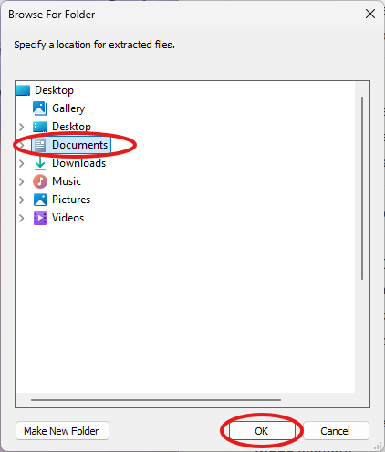
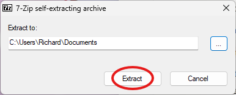
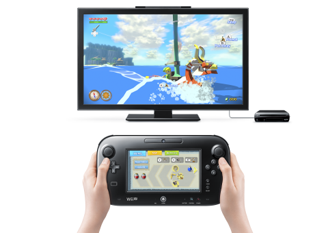
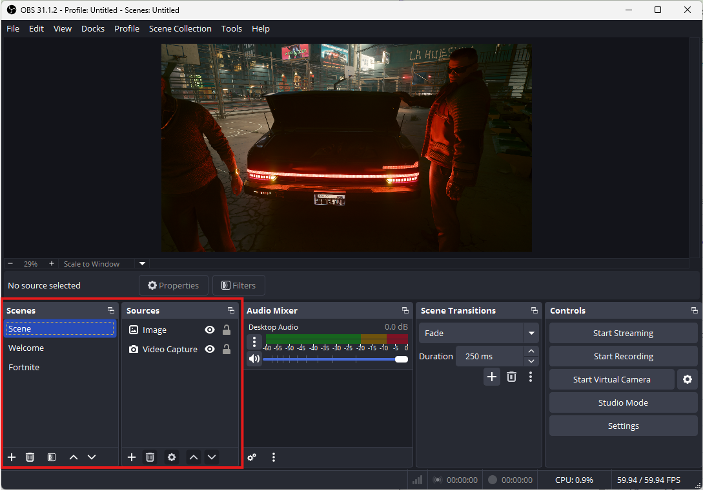
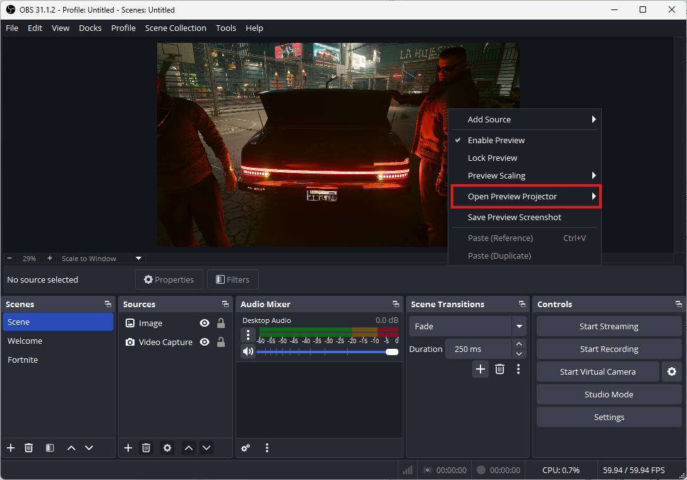
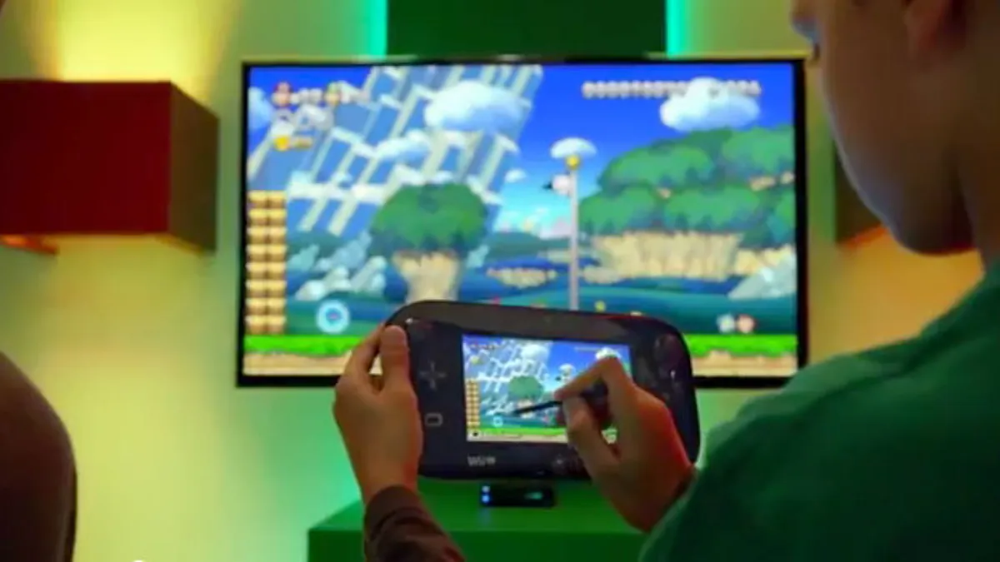
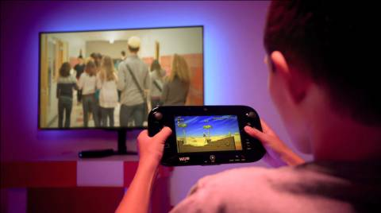
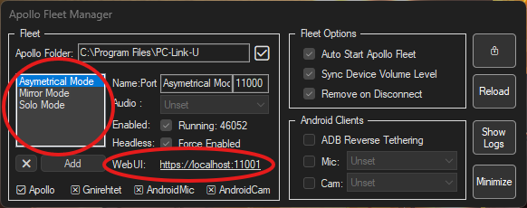

# PC-Link-U

## About

PC-Link-U is a self-hosted game streaming solution built on top of Apollo, designed to provide flexible streaming modes for various gaming scenarios. It automatically configures three instances, each tailored for a specific mode: **Asymmetrical**, **Solo**, and **Mirror**. These instances come with preconfigured settings to streamline setup and enhance the gaming experience.

**Key Features**:

- **Three Preconfigured Instances**: Asymmetrical Mode, Solo Mode, and Mirror Mode, each optimized for different use cases.
- **Seamless Integration**: Works with ApolloFleet to manage streaming instances efficiently.
- **Tip**: Keep the ApolloFleet icon in the system tray and hide the three instances. Closing an instance while ApolloFleet is running will cause it to automatically reopen, causing a loop. You can easily manage all three instances from ApolloFleet anyways.

## Prerequisites

To use PC-Link-U, ensure the following requirements are met:

1. **All Apollo Prerequisites**: PC-Link-U relies on Apollo's dependencies. See the **Apollo README** below for a complete list of required software, libraries, and system configurations.
2. **OBS Studio**: OBS Studio is required for capturing and streaming game content, particularly in Asymmetrical Mode. Install it from https://obsproject.com/ and ensure it’s located at `C:\Program Files\obs-studio\bin\64bit\obs64.exe`.

## Installation Guide

Follow these steps to install and set up PC-Link-U:

1. **Download the Installer**:
   - Visit the Releases tab on the PC-Link-U GitHub repository.
   - Download the latest `PC-Link-U-0.9.9-win64.exe` installer.
2. **Run the Installer**:
   - Execute the downloaded `PC-Link-U-0.9.9-win64.exe` as an administrator to install PC-Link-U to `C:\Program Files\PC-Link-U`.
3. **Run the Setup Script**:
   - Navigate to `C:\Program Files\PC-Link-U\scripts\essential\`.
   - Run `complete_setup.ps1` by right-clicking and selecting "Run with PowerShell as Administrator" or using the command:

     ```bash
     powershell -ExecutionPolicy Bypass -File "C:\Program Files\PC-Link-U\scripts\essential\complete_setup.ps1"
     ```


   - Accept the administrative privileges prompt when prompted.
4. **Configure ApolloFleet**:
   - When the 7zip self-extractor (`apollofleet.exe`) opens, select the Documents folder (`%USERPROFILE%\Documents`) as the extraction destination.




5. **Complete Setup**:
   - Wait for the script to finish. It will generate configuration files (`settings.ini`, `fleet-1.conf`, `fleet-2.conf`, `fleet-3.conf`) in `%USERPROFILE%\Documents\ApolloFleet\config`.
   - Once the script completes, PC-Link-U is installed and ready to use.
   - **Tip**: If changing from Apollo/Sunshine, and you want to keep any applications you have made previously, make 3 copies of the apps.json file in your Sunshine/Apollo config folder, close ApolloFleet AND all 3 instances of PC-Link-U, rename the 3 copies of apps.json to apps-1.json, apps-2.json, and apps-3.json, and move them into the %USERPROFILE%\\Documents\\ApolloFleet\\config folder (overwrite if necessary), and relaunch ApolloFleet from %USERPROFILE%\\Documents\\ApolloFleet. You can uninstall Apollo/Sunshine afterwards.
     
## Modes

PC-Link-U supports three distinct streaming modes, each tailored for specific gaming scenarios. Below are the details for each mode.

### Asymmetrical Mode

Asymmetrical Mode adds the client device as a separate monitor while keeping the PC’s primary display intact. This mode is ideal for scenarios requiring dual-screen setups, such as Wii U or Nintendo DS/3DS emulation, where the PC screen displays the main game and the client device acts as a secondary screen (e.g., the Wii U GamePad or DS bottom screen). Also could be used just to make a client act as a dedicated monitor. Good example can be seen here: https://www.reddit.com/r/SteamDeck/comments/1kscuvz/my_steam_deck_can_now_be_used_as_basically_a/



#### OBS

Using OBS Studio is key to maximizing Asymmetrical Mode’s potential. OBS allows you to create scenes by capturing various program windows, game elements, or other sources and projecting them in fullscreen to the client device. This creates a Wii U GamePad-like UI on the client, while the main game runs on the PC’s primary screen. For example:

- Capture specific game UI elements (e.g., maps, menus) on the client screen.

- Combine multiple sources (windows, game captures) into a custom scene for a tailored experience per game, using different OBS scenes as different profiles. Adding obs64.exe to each application in PC Link U as a detached command with the launch parameter --scene "GAME" while also using stop process as an undo command, and setting OBS to remember projectors on startup will allow the specific game scene to appear on the client screen while the main game launches through PC Link U.
  



#### Native

Asymmetrical Mode also supports native applications that utilize secondary displays. Examples include:

- **Microsoft Flight Simulator**: Drag a secondary window (e.g., cockpit instruments) to the client screen while the main game runs on the PC screen.
- **Wii U/3DS/DS Emulation**: Use the PC screen as the top screen and the client device as the bottom screen for touch or secondary display purposes.
- **Multi-Tasking**: Play a YouTube video, open the Spotify player, etc. on handheld/phone screen, while game plays on main screen. Useful for walkthrough videos, or anything else a secondary monitor could be useful for.
- **Tip**: Asymmetrical Mode includes the **input-only mode** (`enable_input_only_mode = enabled` in `fleet-1.conf`), allowing a phone or handheld device to function solely as a controller for the PC, without displaying any content or recieving any audio. You could, in theory, use the client screen as the primary display, and use the PC monitor as an auxilary, reversing the roles.

### Mirror Mode

Mirror Mode captures the PC’s primary display and streams it to the client device. This mode requires an initial display device ID entry in the **Audio/Video** section of the configuration tab in the web UI (`https://localhost:12001/config.html` by default for Mirror Mode). It’s ideal for couch party games where one player uses a handheld or phone to view the game, while others watch on a shared TV or monitor. Examples include:

- **Mario Party**, **Rounds**, **Gang Beasts**, **Stick Fight**: One player plays and sees the game via the client device, while the rest of the group views the game on the main display. This mode ensures a seamless, low-latency experience for local multiplayer gaming.
  


### Solo Mode

Solo Mode disables all other displays and streams exclusively to the client device. This mode is perfect for:

- **Remote Play at Home**: Play games from a handheld or phone while away from the PC (e.g., in another room).
- **Remote Play Away from Home**: Access your gaming PC from anywhere with an internet connection. Solo Mode ensures the client device is the sole display, optimizing performance for remote gaming scenarios.
  


## Changing Settings

All three instances of PC-Link-U (Asymmetrical, Solo, and Mirror) can be customized to suit user-specific requirements using the ApolloFleet Manager. After running the post-installation script (`complete_setup.ps1`), the ApolloFleet Manager opens automatically. To configure settings for each instance:

1. Open the ApolloFleet Manager from the system tray
2. In the ApolloFleet Manager interface, locate the Web UI link for each instance (Each can be found by clicking the specific instance in ApolloFleet).
3. Click the Web UI link for the desired instance to access its configuration page in your web browser.
   


4. Adjust settings such as network settings, input permissions, or application configurations as needed. Refer to the **Apollo README** below for detailed configuration options. This process allows users to tailor each instance’s settings to their specific gaming needs, ensuring optimal performance and compatibility. Most settings are either preconfigured or client sided, but a few changes (like upnp, encoder settings, etc.) may be necessary. Remember that each instance has its own settings, so you may have to change certain settings in all of them to get desired results.

## Thanks

I extend my heartfelt gratitude to the following teams and individuals for their contributions, which made PC-Link-U possible:

- **Moonlight Team**: For developing the Moonlight client, providing a robust foundation for game streaming.
- **ClassicOldSong**: For creating the Apollo host and Artemis client, enabling low-latency streaming with advanced features like virtual displays and HDR support.
- **drajabr**: For developing ApolloFleet, a powerful tool for managing multiple streaming instances with an intuitive GUI.
- **LizardByte**: For creating the Sunshine host, which inspired and supports the core streaming functionality of Apollo.

## --Original Apollo README--

Apollo is a self-hosted desktop stream host for Artemis (Moonlight Noir). Offering low latency, native client resolution, cloud gaming server capabilities with support for AMD, Intel, and Nvidia GPUs for hardware encoding. Software encoding is also available. A web UI is provided to allow configuration and client pairing from your favorite web browser. Pair from the local server or any mobile device.

Major features:

- [x] Built-in Virtual Display with HDR support that matches the resolution/framerate config of your client automatically

- [x] Permission management for clients

- [x] Clipboard sync

- [x] Commands for client connection/disconnection (checkout Auto pause/resume games)

- [x] Input only mode

### Usage

Refer to LizardByte's documentation hosted on Read the Docs for detailed usage instructions.

Currently Virtual Display support is Windows only, Linux support is planned and will be implemented in the future.

### About Permission System

Check out the Wiki

> \[!NOTE\] The **FIRST** client paired with Apollo will be granted with FULL permissions, then other newly paired clients will only be granted with `View Streams` and `List Apps` permission. If you encounter `Permission Denied` error when trying to launch any app, go check the permission for that device and grant `Launch Apps` permission. The same applies to the situation when you find that you can't move mouse or type with keyboard on newly paired clients, grant the corresponding client `Mouse Input` and `Keyboard Input` permissions.

### About Virtual Display

> \[!WARNING\] ***It is highly recommend to remove any other virtual display solutions from your system and Apollo/Sunshine config, to reduce confusions and compatibility issues.***

> \[!NOTE\] **TL;DR** Just treat your Artemis/Moonlight client like a dedicated PnP monitor with Apollo.

Apollo uses SudoVDA for virtual display. It features auto resolution and framerate matching for your Artemis/Moonlight clients. The virtual display is created upon the stream starts and removed once the app quits. **If you do not see a new virtual display added or removed when the stream starts or stops, there may be a driver misconfiguration, or another persistent virtual display might still be active.**

The virtual display works just like any physically attached monitors with SudoVDA, there's completely no need for a super complicated solution to "fix" resolution configurations for your devices. Unlike all other solutions that reuses one identity or generate a random one each time for any virtual display sessions, **Apollo assigns a fixed identity for each Artemis/Moonlight client, so your display configuration will be automatically remembered and managed by Windows natively.**

### Configuration for Dual GPU Laptops

Apollo supports dual GPUs seamlessly.

If you want to use your dGPU, just set the `Adapter Name` to your dGPU and enable `Headless mode` in `Audio/Video` tab, save and restart your computer. No dummy plug is needed any more, the image will be rendered and encoded directly from your dGPU.

### About HDR

HDR starts supporting from Windows 11 23H2 and generally supported on 24H2. Some systems might not have HDR toggle on 23H2 and you just need to upgrade to 24H2. Any system lower than 23H2/Windows 10 will not have HDR option available.

### System Requirements

| **Component** | **Description** |
| --- | --- |
| GPU | AMD: Video Coding Engine 3.0 or higher, see: AMD VCN |
|  | Intel: Quick Sync enabled CPU, see: intel linuxmedia |
|  | Nvidia: NVENC enabled cards, see: nvenc support matrix |
| CPU | AMD: Ryzen 3 or higher |
|  | Intel: Core i3 or higher |
| RAM | 4GB or more |
| OS | Windows: 10+ (Windows Server requires manual installation for gamepad support) |
|  | macOS: 12+ |
|  | Linux/Debian: 11 (bullseye) |
|  | Linux/Fedora: 39+ |
|  | Linux/Ubuntu: 22.04+ (jammy) |
| Network | Host: 5GHz, 802.11ac |
|  | Client: 5GHz, 802.11ac |

**4k Suggestions**

| **Component** | **Description** |
| --- | --- |
| GPU | AMD: Video Coding Engine 3.1 or higher |
|  | Intel: HD Graphics 510 or higher |
|  | Nvidia: GeForce GTX 1080 or higher |
| CPU | AMD: Ryzen 5 or higher |
|  | Intel: Core i5 or higher |
| Network | Host: CAT5e ethernet or better |
|  | Client: CAT5e ethernet or better |

**HDR Suggestions**

| **Component** | **Description** |
| --- | --- |
| GPU | AMD: Video Coding Engine 3.4 or higher |
|  | Intel: UHD Graphics 730 or higher |
|  | Nvidia: Pascal-based GPU (GTX 10-series) or higher |
| CPU | AMD: todo |
|  | Intel: todo |
| Network | Host: CAT5e ethernet or better |
|  | Client: CAT5e ethernet or better |

### Integrations

SudoVDA: Virtual Display Adapter Driver used in Apollo

Artemis: Integrated Virtual Display options control from client side

**NOTE**: Artemis currently supports Android only. Other platforms will come later.

### Support

Currently support is only provided via GitHub Issues/Discussions.

No real time chat support will ever be provided for Apollo and Artemis. Including but not limited to:

- Discord
- Telegram
- Whatsapp
- QQ
- WeChat

> When there's a chat, there're dramas. -- Confucius

### Downloads

Releases

### Disclaimer

I got kicked from Moonlight and Sunshine's Discord server and banned from Sunshine's GitHub repo literally for helping people out.

This is what I got for finding a bug, opened an issue, getting no response, troubleshoot myself, fixed the issue myself, shared it by PR to the main repo hoping my efforts can help someone else during the maintenance gap.

Yes, I'm going away. Apollo and Artemis (Moonlight Noir) will no longer be compatible with OG Sunshine and OG Moonlight eventually, but they'll work even better with much more carefully designed features.

The Moonlight repo had stayed silent for 5 months, with nobody actually responding to issues, and people are getting totally no help besides the limited FAQ in their Discord server. I tried to answer issues and questions, solve problems within my ability but I got kicked out just for helping others.

**PRs for feature improvements are welcomed here unlike the main repo, your ideas are more likely to be appreciated and your efforts are actually being respected. We welcome people who can and willing to share their efforts, helping yourselves and other people in need.**

**Update**: They have contacted me and apologized for this incident, but the fact it **happened** still motivated me to start my own fork.

### License

GPLv3

## --Original ApolloFleet README--

A simple tool to configure multiple instances of Apollo for streaming multi-monitor mode, mainly targeting desktop use cases where multiple devices like Android tablets can be used as Plug and Play external monitors.

This is the same concept of my old Multi-streaming-setup scripts, with ease of GUI and Auto Configuration, bundled with necessary binaries for Android clients stuff.

### Preview

### How to Use

### Current Status

> \[!Note\] Please bear in mind I'm not a professional programmer, this tool could have many issues or some unimplemented features yet, but this is an an essential tool for me I use everyday so expect I keep working on delivering fixes and features for it.
>
> If you find any issue please don't hesitate to open an issue in the repo, your feedback "and pull requests" are very welcomed.

### Changelog

- v0.3.3 Bug fixes
  - FIX: Run with powershell full path to avoid errors if not defined in PATH for some reason
  - FIX: Reset window area if one monitor disconnected
  - FIX: Stop all timers before apply, so don't result orphand processes in some cases
  - FIX: Properly delete instances from settings file
  - FIX: Handle terminate-on-pause override properly if the apps.json was already initialized
- v0.3.2 Bug fixes and enhancements
  - FIX: Proper JSON boolean handling
  - FIX: Preserve pids properly, in separate "transient" ini file
  - FIX: Allow alternative path for apollo
  - UX: Add option to enable/disable headless mode per-instance
  - Fix: Disable if "Unset" for android cam/mic features
- v0.3.1 DARK Theme! & Apollo elevated run
  - UI: Dark Theme: Follows system for now (could be changed from settings.ini too)
  - FIX: Apollo runs with service permissions using PsExec (well paexec used here)
  - FIX: Unset configs properly
  - Manager: More non-blocking start and kill to increase responsivity
  - FIX: Volume sync now works with audio device set other than default output
- v0.2.9hotfix - Standalone operation hotfix
  - FIX: Launch process if its killed or not launched
  - FIX: Delay startup run 30 sec to allow systray init properly
- v0.2.9 - Standalone operation fix
  - FIX: Don't use default instance as a reference
  - FIX: Non-blocking termination of unnecessary processes
  - FIX: More validation for list selected item
  - UI: Removed sync instances with default instance checkbox
  - UI: Add enable/disable checkbox to control each instance
- v0.2.2 - Nothing exciting, dumb hotfixes
  - FIX: more non-blocking bootstrap
  - FIX: Volume level sync for multi instance
- v0.2.1 - Volume Sync
  - Multi-instance: Sync device volume levels to all instances
- v0.1.1 - Quite the fundamental functionality!
  - UX: Create scheduled task to run privileged at user logon!
  - Multi-instance: Allow Separate Audio Device selection
  - GUI: Add Audio Device Selector for each instance
  - GUI: Allow per-instance Copy other settings from default
  - GUI: Introduce "statusbar" for future functionality
  - FIX: Separate Log, credentials, and state file for each instance
  - FIX: Actually remember the old processes and keep them
  - FIX: Add headless_mode enabled to the configurations
- v0.0.2 - Second preview release - slightly improved
  - Multi-instance: don't kill the process if we created it earlier
  - Code improvement: more scoped write settings
  - Code improvement: better settings handling for runtime variables we need to keep
  - Code improvement: smart process termination using sigint
  - Release: create simple sfx installer
- v0.0.1 - Preview release - basic functionality
  - GUI: Basic functional GUI elements
  - GUI: Load, Edit, and Save settings
  - GUI: minimize, close, show/hide logs area
  - Multi-instance: Add, remove, edit multi instance
  - Multi-instance: Read and write config files
  - Multi-instance: Automatically start instances

### Functionality

- [x] Multi-instance: Add/remove Multiple instance configuration

- [x] Multi-instance: Auto-startup on user logon

- [x] Multi-instance: Configurable per-instance Audio Device

- [x] Multi-instance: Sync device volume levels to all instances

- [x] Multi-instance: Enable terminate-on-pause setting to Remove virtual display on client disconnect

- [x] Multi-instance: Maintain Apollo instances "in case one exit/crash"

- [x] Multi-instance: Fix volume level sync

- [x] Android Clients: ADB Reverse tethering via Gnirehtet

- [x] Android Clients: Maintain client Mic to PC using scrcpy

- [x] Android Clients: Maintain client Cam to PC using scrcpy

- [ ] Android Clients: Automate virtual Cam (need suitable driver first)

- [ ] Android Clients: Support Mic with other than scrcpy (like AndroidMic)

- [ ] Android Clients: Automate virtual Cam (something like tiny obs client?)

- [ ] Android Clients: Support Cam for Android version below 12 (like DroidCamX)

- [ ] Android Clients: Possibly bind instance to a device, thus that as soon as it connects launch the client using adb shell?

### Many Thanks To:

@ClassicOldSong Apollo

AutoHotKey AHK

@alfvar AHK v2 Actions template

@thqby Audio.ahk and JSON.ahk

@ntepa Audio.ahk lib

@cyruz StdoutToVar.ahk
